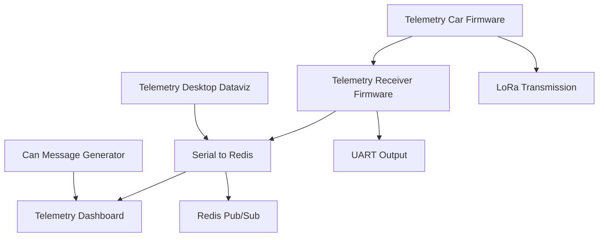

# Telemetry System Overview

Welcome to the telemetry system documentation! This README provides an overview of how our telemetry projects interact to form a comprehensive vehicle data monitoring system.

## Projects Overview

### **1. telemetry-dashboard**

The **real-time vehicle data monitoring system** with two key components:
- **GraphQL Server**: Handles real-time updates via GraphQL subscriptions and uses Redis for pub/sub functionality.
- **React Dashboard**: Displays live vehicle metrics in a customizable layout using the data provided by the GraphQL server.

### **2. serial-to-redis**

A **Python script** that bridges CAN data to Redis:
- **Reads and Decodes CAN Messages**: Interprets CAN messages using a DBC file.
- **Publishes to Redis**: Feeds data to Redis, which is then used by the GraphQL server in `telemetry-dashboard`.

### **3. telemetry-car-firmware**

**Firmware** for vehicle telemetry using the ESP32 microcontroller:
- **CAN Communication**: Collects data from the vehicle’s CAN bus.
- **LoRa Radio**: Transmits collected data wirelessly.

This firmware sends CAN data that can be ingested by the `serial-to-redis` script, integrating with `telemetry-dashboard`.

### **4. telemetry-desktop-dataviz**

**Python scripts** for data visualization and storage:
- **dataviz.py**: Reads serial data, decodes it, and displays it with gauges for local monitoring and testing.
- **store_stream.py**: Stores serial data in a file for later analysis.

These scripts are useful for visualizing and analyzing data locally and complement the data flow to `telemetry-dashboard`.

### **5. telemetry-receiver-firmware**

**Firmware** for receiving LoRa messages:
- **Receives and Extracts CAN Messages**: Processes LoRa packets to extract CAN data.
- **Outputs to UART**: Provides CAN messages for further processing or visualization.

This firmware complements `telemetry-car-firmware` by receiving and making CAN messages available for other systems.

### **6. can-message-generator**

**Code** for generating sample CAN messages:
- **TWAI Module with FreeRTOS**: Initializes and sends random CAN messages.
- **Testing and Development**: Provides simulated data for testing and development purposes.

This generator is used to create sample data for `telemetry-dashboard` and other components.

## System Interaction

Here's how these components work together:

1. **Telemetry-Car-Firmware** collects CAN data and transmits it via LoRa.
2. **Telemetry-Receiver-Firmware** receives the LoRa messages, extracts CAN data, and sends it to UART.
3. **Serial-to-Redis** reads CAN messages from either serial ports or files, decodes them, and publishes them to Redis.
4. **Telemetry-Dashboard** subscribes to Redis for real-time CAN message updates and displays them through its React dashboard.
5. **Telemetry-Desktop-Dataviz** can be used for local visualization and storage of serial data.
6. **CAN-Message-Generator** provides sample data for testing purposes.

## Diagram

Here is a Mermaid diagram that illustrates the interaction between the different projects:

## Contributing

We welcome contributions to improve and extend the telemetry system. Please fork the repository and submit a pull request with your changes.

## License

This project is licensed under the MIT License. See the [LICENSE](LICENSE) file for details.
